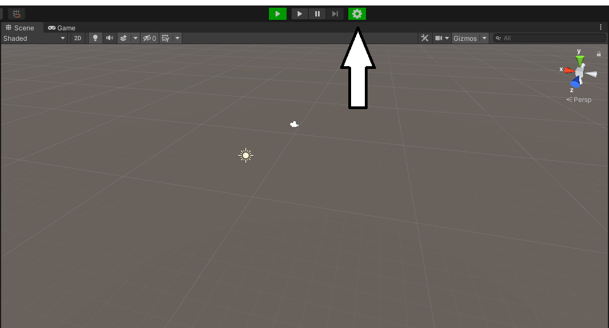
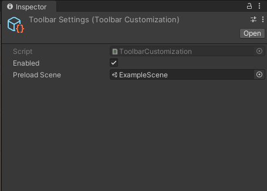

# UnityToolbar
Simple Implementation Of How The Awesome Plugin [*UnityToolbar Extender*](https://github.com/marijnz/unity-toolbar-extender)
Can Be Used

## What It Does
This Implementation Includes A Few Scripts Which Makes You Able To Choose One Scene To Be Your *"PreLoadScene"*
A Scene Where You Include Dependencies That Needs To Be Loaded At Start (Something A Lot Of Games Will Need). 
The Script Will Then Create An Extra Play Button Next To The Normal Play Button Which When Clicked Loads The 
*"PreloadScene"* And Launches From That One When Play Mode Is Exited It The Returns To The Scene You Were Working 
In Just Before Pressing The Button 

## How To Use It
After Installing You'll See Two New Buttons In The Toolbar A Settings Wheel And A Green Playbutton Click The Settings Wheel To Start Setting It Up

Now When You're In The Settings Menu You Can Attach Whatever Scene You Like To Be Your *"PreLoadScene"*

Voila You're Now Ready To Start Using The Green Play Button To Load The *"PreLoadScene"* Wherever You're Currently Working In The Project

## [UnityPackage Download]
